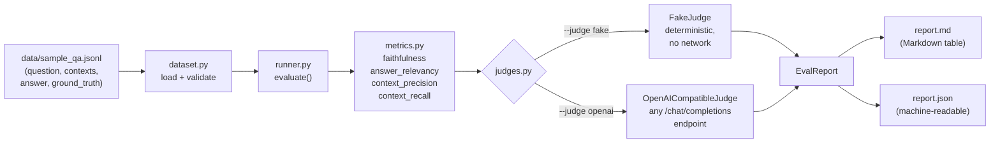

# rag-eval-lab

[](https://github.com/bolongpa/rag-eval-lab/actions/workflows/ci.yml)
[](LICENSE)
[](pyproject.toml)

A lightweight, dependency-minimal **LLM-as-judge evaluation harness for RAG pipelines**. Point it at a JSONL dataset of `(question, contexts, answer, ground_truth)` records and get per-sample scores plus aggregate means across four standard RAG metrics — rendered as JSON and Markdown reports.

Built for iterating on retrieval and generation quality without wiring up a heavy eval framework.

## Why LLM-as-judge evaluation matters

In production RAG, the failure modes that hurt users are semantic, not syntactic: the retriever fetches plausible-but-irrelevant chunks, or the generator writes a fluent answer that invents facts. String-overlap metrics (BLEU, ROUGE, exact match) can't see either failure — a hallucinated answer can share most of its tokens with the ground truth.

LLM-as-judge evaluation addresses this by asking a capable model to *reason about* each sample: split the answer into claims and check them against the retrieved contexts, judge whether the retrieved chunks are actually relevant, and so on. It is the standard approach used by RAGAS, DeepEval, and TruLens — this project is a small, readable, hackable implementation of the same idea, with:

- **Four focused metrics** covering generation quality *and* retrieval quality separately (so you know *which half* of the pipeline to fix)
- **Any OpenAI-compatible endpoint** as the judge (OpenAI, vLLM, Ollama, LiteLLM, OpenRouter, …) — no vendor lock-in
- **A deterministic fake judge** for demos, CI, and unit tests — no API key or network needed
- **Stdlib + `requests` only** at runtime

## Architecture



Each metric builds a dedicated evaluation prompt (claim-level checking for faithfulness, chunk-level relevance for precision, key-fact coverage for recall), sends it to the judge, and parses a `0–1` score out of the judge's free-text verdict with a tolerant parser (`SCORE: 0.85`, `{"score": 0.9}`, `8/10`, `85%` all work).

## Quickstart

```bash
git clone https://github.com/bolongpa/rag-eval-lab.git
cd rag-eval-lab
python -m venv .venv && source .venv/bin/activate
pip install -r requirements.txt

# Demo: deterministic fake judge, no API key, no network
python -m rag_eval.cli run \
  --dataset data/sample_qa.jsonl \
  --judge fake \
  --report report.md --json-report report.json
```

Or install the `rag-eval` console script:

```bash
pip install -e .
rag-eval run --dataset data/sample_qa.jsonl --judge fake --report report.md
```

### Using a real judge model

```bash
export LLM_BASE_URL="https://api.openai.com/v1"  # or your vLLM / Ollama / LiteLLM gateway
export LLM_API_KEY="sk-..."
export LLM_MODEL="gpt-4o-mini"                   # optional
rag-eval run --dataset data/sample_qa.jsonl --judge openai --report report.md
```

Tip: `temperature` is fixed to `0.0` for the judge calls so scores are as reproducible as the model allows.

### Selecting metrics

```bash
rag-eval run --dataset data/sample_qa.jsonl \
  --metrics faithfulness,answer_relevancy \
  --judge fake
```

| Metric | What it measures | Tells you |
|---|---|---|
| `faithfulness` | Fraction of answer claims supported by the retrieved contexts | Whether the generator hallucinates |
| `answer_relevancy` | How directly the answer addresses the question | Whether the answer is on-topic and complete |
| `context_precision` | Fraction of retrieved chunks relevant to the question | Whether retrieval fetches noise (wasted tokens, hallucination surface) |
| `context_recall` | Fraction of ground-truth key facts covered by the retrieved chunks | Whether retrieval misses needed information |

## Example report

Below is the actual output of the demo run above, using the **deterministic fake judge** on the bundled 8-sample dataset (a fictional "Acme Corp" employee handbook with a mix of good answers, hallucinated answers, and incomplete retrieval). Scores are canned — they demonstrate the report format, not model performance.

```
RAG evaluation complete
  samples : 8
  judge   : FakeJudge
  means   :
    faithfulness       0.920
    answer_relevancy   0.850
    context_precision  0.780
    context_recall     0.640
```

`report.md` renders the same numbers as Markdown tables — one aggregate table plus a per-sample breakdown — suitable for pasting into a PR or design doc.

## Bring your own dataset

One JSON object per line:

```jsonl
{"question": "...", "contexts": ["chunk 1...", "chunk 2..."], "ground_truth": "...", "answer": "..."}
{"question": "...", "contexts": ["..."], "ground_truth": "...", "answer": "..."}
```

All four fields are required; `contexts` must be a non-empty list of strings. The loader validates every line and reports the offending line number on errors. Generate records from your own pipeline logs: log the retrieved chunks, the generated answer, and (for offline eval sets) a human-written ground truth.

## Project structure

```
rag-eval-lab/
├── rag_eval/
│   ├── __init__.py      # public API
│   ├── judges.py        # Judge protocol, FakeJudge, OpenAICompatibleJudge
│   ├── metrics.py       # 4 metrics + tolerant score parser
│   ├── dataset.py       # JSONL loader with schema validation
│   ├── runner.py        # evaluate() -> EvalReport (JSON/Markdown)
│   └── cli.py           # `rag-eval run` argparse CLI
├── data/
│   └── sample_qa.jsonl  # 8 hand-written Acme Corp examples
├── tests/               # pytest suite (no network)
├── .github/workflows/ci.yml  # pytest on 3.10/3.11/3.12 + CLI smoke test
├── requirements.txt     # runtime: requests only
└── requirements-dev.txt # + pytest
```

## Design decisions

- **Judge as a `Protocol`, not a base class.** Any object with a `score(prompt) -> dict` method works — easy to plug in a LangChain wrapper, a local model, or a human-in-the-loop judge without subclassing.
- **Tolerant score parsing.** Judge models drift in output format. `parse_score` understands `SCORE:`, JSON, `x/1`, `x/10`, and `%` forms, normalizes to `[0, 1]`, and raises a clear `ValueError` (with the raw text) instead of silently returning garbage.
- **Metrics are plain functions**, registered in a `METRICS` dict by CLI name. Adding a metric is: write the prompt-builder function, add one line to the registry.
- **FakeJudge emits the real output format.** Demos and tests exercise the exact same prompt → parse pipeline as production calls, so format-handling bugs surface in CI, not at 2am.
- **No network in tests.** Everything touching HTTP is behind the judge boundary; the suite runs offline in under a second.

## Roadmap

- Pairwise / Bradley-Terry comparison mode for A/B-ing two pipeline variants
- Cost/latency tracking per judge call (tokens, $)
- Reference-free faithfulness variant (no ground truth needed)
- Bootstrap confidence intervals on aggregates
- HTML report with per-sample claim-level breakdowns

## Evaluation status

All numbers shown in this README come from the deterministic `FakeJudge` on the bundled 8-sample demo set — they illustrate the report format, not model performance. No public-benchmark scores are claimed. Planned benchmark work is listed under Roadmap.

## Citation

If you use this project in academic or technical work, please cite it as:

```bibtex
@software{pan2026ragevallab,
  author = {Bolong Pan},
  title = {rag-eval-lab: a lightweight LLM-as-judge evaluation harness for RAG pipelines},
  year = {2026},
  url = {https://github.com/bolongpa/rag-eval-lab},
  doi = {10.5281/zenodo.23034524}
}
```

DOI: [10.5281/zenodo.23034524](https://doi.org/10.5281/zenodo.23034524)

## License

MIT — see [LICENSE](LICENSE).
